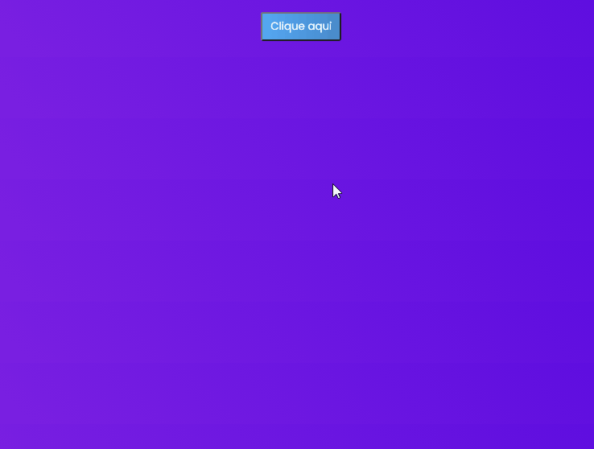

<!-- <h1 align="center">
    
</h1> -->

<h1 align="center">Pop-up Deselegante</h1>

<h4 align="center"> 
    🚧 CJRM - Curso de JavaScript Roger Melo 🚀 em construção... 🚧
</h4>

  

<!--  -->

## 💻 Objetivo

📚 Uma aplicação desenvolvida com o intuito de praticar meus conhecimentos com JavaScript puro.

## 📚 O que pratiquei/aprendi com essa aplicação

- Manipulação do DOM
- Utilização do document.querySelector para obter a referência dos elementos
- Utilização de eventos de clique
- Utilização do método some()
- Refatoração de código

## 🛠 Tecnologias

- [HTML](https://pt.wikipedia.org/wiki/HTML) 
- [CSS](https://pt.wikipedia.org/wiki/Cascading_Style_Sheets)
- [JavaScript](https://pt.wikipedia.org/wiki/JavaScript)

## :memo: Licença

Este projeto está sob a licença do MIT. Consulte a [LICENÇA](https://github.com/holivei531/Pop-up-Deselegante/blob/master/License) para obter mais informações.

Feito com ❤️ por Hildebrando Junior 